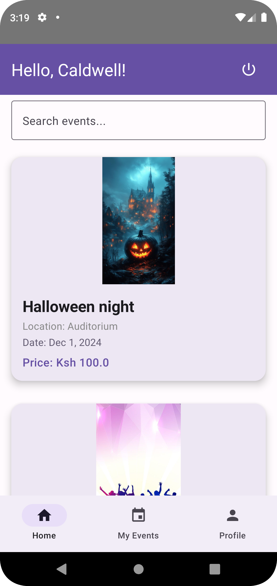

# 🎉 Event Planning App

An Android app built with **Kotlin** and **Firebase** to help users browse, book, and manage events. After successful registration, the app sends a confirmation **email ticket** to the user.



---

## ✨ Features

- 🔍 **Search Events** – Users can filter events by name or keyword.
- 📅 **Event Listing** – Each card shows event image, name, location, date, and price.
- 📧 **Email Tickets** – Sends a confirmation email upon event registration.
- 🧑‍💼 **User Greeting** – Personalized greetings based on user profile.
- 📆 **My Events** – Lists the events a user has booked.
- ☁️ **Firebase Realtime Database** – Stores and fetches event data in real time.
- 💎 **Material Design UI** – Intuitive layout with clear navigation.

---

## 🧑‍💻 Tech Stack

| Component         | Technology             |
|------------------|------------------------|
| Language          | Kotlin                |
| Database          | Firebase Realtime DB  |
| UI                | XML Layouts + Material Design |
| Email             | Intent / JavaMail API |
| IDE               | Android Studio        |

---

## 🚀 Getting Started

### Prerequisites

- Android Studio (Arctic Fox or newer)
- Kotlin 1.7+ support
- Firebase account and project setup
- Device or emulator running Android 7.0+ (API level 24+)

### Setup Instructions

```bash
git clone https://github.com/Caldwell10/Event-Planning-App.git
cd Event-Planning-App
```
